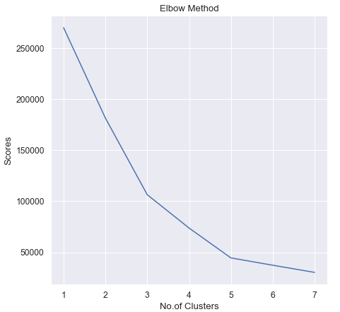
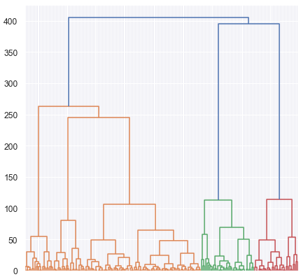

# Mall_Customers_Clustering
In this project i applied clustering algorithms in mall customers dataset. I got number of clusters that refers to number of categories of users.
## Used Libraries:
- Pandas
- Seaborn
- Matplotlib
- Sklearn
- Scipy
- Warnings
## Elbow Method

## Dendrogram

